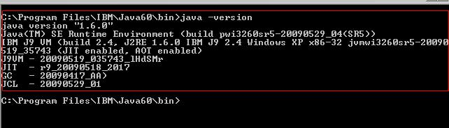

# Tutoriais de preparação para começar a codar em Java

Olá, tudo bem com vc??

Nesta página você encontrará informações relacionadas à preparação do seu computador para começar a codar em Java!

## Como preparar meu ambiente de desenvolvimento?

Além de instalar o próprio Java em seu computador, você precisará de uma IDE que te auxilie a criar seus códigos. Siga os tutoriais abaixo para fazer essa configuração.

## 1. Instale o Java

Instale e configure o Java. 

### Passo 1. Entre no site da Oracle e faça o download

Faça o download do JDK Development Kit 17.0.9 no site da Oracle, de acordo com o seu sistema operacional.
Atente-se para baixar o pacote compactado de acordo com o seu sistema operacional. 

[Link para o site da Oracle](https://www.oracle.com/java/technologies/downloads/#jdk17-linux)

#### Para o Windows

Recomendo que baixe o arquivo no formato .exe para simplificar a instalação. 

#### Para o Linux (Ubuntu)

Recomendo que baixe o arquivo no formato tar.gz que facilitará a instalação. 

### Passo 2. Execute o instalador

Após o download do arquivo de instalação ter sido concluído, a instalação é feita executando o programa de instalação.

#### Para o Windows

Executar o programa de instalação e clicar next em todas as telas apresentadas. O processo é simples e rápido.

#### Para o Linux

Abra um terminal, vá para a pasta Downloads e copie o arquivo de instalação para o diretório de sua preferência com o comando abaixo

`cp jdk-<versão>.tar.gz <caminho-completo-do-seu-diretório>`

Mude para o diretório que vc escolheu 

`cd /<caminho-completo-do-seu-diretório>`

Descompacte o arquivo com o comando a seguir

`tar -zvxf jdk-<versão>.tar.gz`

### Passo 3. Configurando o Java

A configuração consiste na criação das variáveis de ambiente JAVA_HOME e CLASSPATH. Estas variáveis são importantes para que os programas encontrem onde o JDK foi instalado.

#### Para o Windows

Execute os comandos abaixo no prompt de comando
        
`setx JAVA_HOME "<diretório-onde-jdk-foi-instalado>"`

`setx CLASSPATH "%JAVA_HOME%\lib"`

`setx PATH "%PATH%;%JAVA_HOME%\bin"`
    
Feche o Prompt.

#### Para o Linux

Abra o terminal e edite o arquivo /etc/profile como o comando abaixo    
    
`sudo gedit /etc/profile`
    
Adicione as linhas abaixo no início do arquivo /etc/profile
    
    JAVA_HOME=diretório-onde-jdk-foi-instalado
    CLASSPATH=.;$JAVA_HOME/lib
    PATH=$PATH:$JAVA_HOME/bin
    export JAVA_HOME
    export CLASSPATH
    export PATH
    
Salve o arquivo e reinicie a sua máquina para que as modificações sejam aplicadas. 

### Passo 4. Testando a configuração

Abrir o Terminal do Linux ou o prompt do Windows e execute o seguinte comando:
    
`java -version`

A saída do terminal deve ser algo parecido com a imagem abaixo, onde pode-se ler a versão do Java instalado.

## 2. Instale o Intellij

Siga o passo a passo a seguir para intalar o IntelliJ. 

### Passo 1. Entre no site do IntelliJ e faça o download

Recomendo que vc utilize o [IntelliJ IDEA](https://www.jetbrains.com/idea/) na versão 2023.2
Community Edition. O site do IntelliJ te redireciona para a fazer o download da Ultimate Edition, porém, você poderá encontrar as versões Community, que recomendo, [aqui](https://www.jetbrains.com/pt-br/idea/download/other.html).

Atente-se para baixar o arquivo mais adequado para o seu sistema operacional. 

### Passo 2. Execute o instlador do IntelliJ 

#### Para o Windows

Executar o programa de instalação e clicar next em todas as telas apresentadas. 

Neste [guia de instalação](https://www.jetbrains.com/help/idea/run-for-the-first-time.html#windows) do próprio intelliJ você encontrará mais informações de como personaliá-lo. 

#### Para o Linux (Ubuntu)

Abra um terminal, vá para a pasta Downloads e copie o arquivo de instalação para o diretório de sua preferência com o comando abaixo

`cp ideaIC-<versão>.tar.gz <caminho-completo-do-seu-diretório>`

Mude para o diretório que vc escolheu 

`cd /<caminho-completo-do-seu-diretório>`

Descompacte o arquivo com o comando a seguir

`tar -zvxf ideaIC-<versão>.tar.gz`

Para iniciar o intelliJ, mude para o diretório que foi criado, com o comando abaixo

`cd idea-IC-<versão>`

Agora abra o intelliJ com o comando abaixo:

`./bin/idea.sh`

Este comando vai inicializar vários arquivos de configuração no diretório de configuração do IntelliJ: 

     ~/.config/JetBrains/IdeaIC2023.2.

[OPCIONAL] Adicione um ícone de atalho (laucher) para abrir o intelliJ mais facilmente. 

Primeiro crie o arquivo intellij.desktop com o comando abaixo: 

`sudo gedit /usr/share/applications/intellij.desktop`

Esse comando abrirá uma janela para editar um arquivo de texto que inicialmente estará vazio. 

Adicione o seguinte texto neste arquivo, atente-se em adicionar o caminho correto para o diretório onde você descompactou o IntelliJ: 

    [Desktop Entry]
    Version=13.0
    Type=Application
    Terminal=false
    Icon[en_US]=<caminho para o diretório onde você descompactou o IntelliJ>/bin/idea.png
    Name[en_US]=IntelliJ
    Exec=<caminho para o diretório onde você descompactou o IntelliJ>/bin/idea.sh
    Name=IntelliJ
    Icon=<caminho para o diretório onde você descompactou o IntelliJ>/bin/idea.png

Salve o arquivo e feche. 

Agora basta abrir o ícone do IntelliJ que foi criado nos aplicativos do seu Ubuntu. 